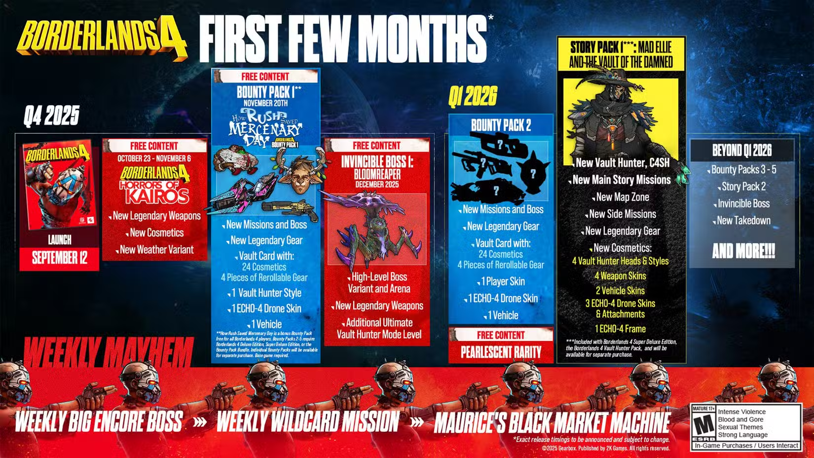
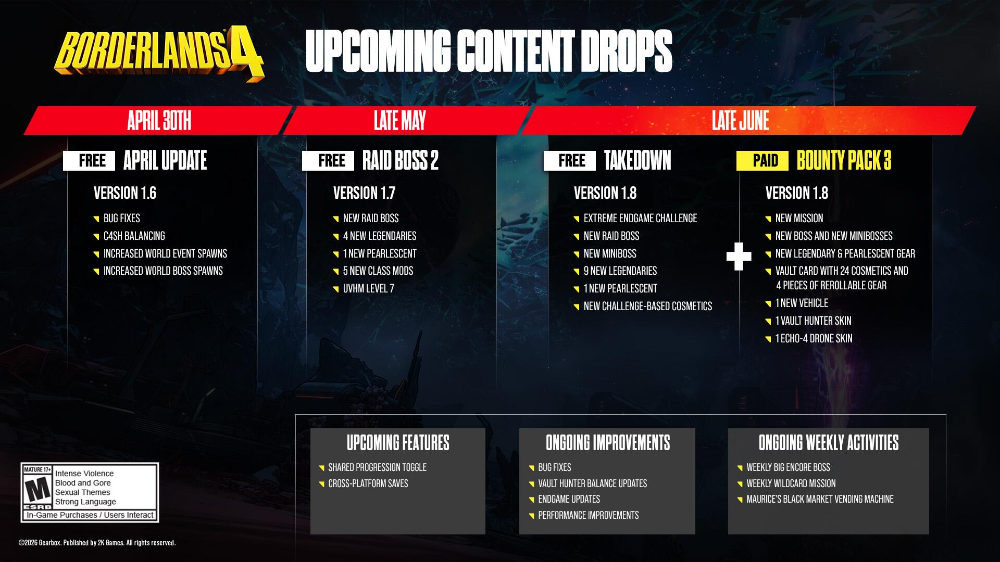

大类 - 厂牌/职业/类别 - 类型 - 物品序号

## 编码表

- A → 枪械 - gun
  - 1 → 代达罗斯 - daedalus
  - 2 → 雅各布斯 - jakobs
  - 3 → 马里旺 - maliwan
  - 4 → 教团 - order
  - 5 → 泰迪尔 - tediore
  - 6 → 托格 - torgue
  - 7 → 开颅者 - ripper
  - 8 → 弗拉多夫 - vladof
    - 1 → 突击步枪 - assault rifle
    - 2 → 手枪 - pistol
    - 3 → 霰弹枪 - shotgun
    - 4 → 冲锋枪 - smg
    - 5 → 狙击枪 - sniper
- B → 重武器 - heavy
    - {厂商}
- C → 其他
  - 1 → 恢复针 - repair kit
    - {厂商}
  - 2 → 手雷 - gadget
    - {厂商}
  - 4 → 模组 - class mod
    - 1 → 魔女 - siren
    - 2 → 锻造骑士 - forgeknight
    - 3 → 铁骨战士 - exo soldier
    - 4 → 重力法师 - gravitar
  - 5 → 护盾 - shield
    - {厂商}
  - 6 → 强化 - enhancement
    - {厂商}

## A. 武器

- 标 `*` 表示未完成拼枪

- 2025年11月20日
  - `BOUNTY1` - 赏金包1：拉西的佣兵节拯救计划 `秘藏卡片1`
- 2025年12月11日
  - `RAID1` - 无敌葬爱花
- 2025年12月11日
  - `BOUNTY2` - 赏金包2：岩石恶魔传奇 `秘藏卡片2`
- 2026年3月26日
  - `STORY1` - 故事包1：狂野艾丽与诅咒秘藏
- 2026年5月28日
  - `RAID2` - 无敌征服者和无敌索尔
- 2026年6月25日
  - `BOUNTY3` - 赏金包3：好人赞恩 `秘藏卡片3`
  - `RAID3` - 强子深渊猎杀
- 2026年7月30日
  - `BOUNTY4` - 赏金包4：血腥并购计划 `秘藏卡片4`
- 2026年9月10日
  - `STORY2` - 故事包2：FL4K与迷失度假村
  - `BOUNTY5` - 赏金包5：阿玛拉与腐化之影 `秘藏卡片5`

### 代达罗斯

- A110 - `紫`獠牙&特种科技
- A111 - 正在行动 Oscar Mike
- A112 - 恒星螺旋 Star Helix
- A113 - 血腥伐木工 Bloody Lumberjack
- A114 - 第一印象 First Impression `PRE-ORDER`
- A115 - 星期三 Mercredi `BOUNTY2` `秘藏卡片2`
- A116 - **黑暗能量 Hard Dark** `BOUNTY3` `清扫王`
- A117 - 碎片狂欢 Shardenfreude `STORY2` `初级经理沃伦特·巴吉特`

- A121 - 测距仪 Rangefinder
- A122 - 拉链 Zipper
- A123 - 银色碎片 Silver Sliver	`BOUNTY4` `副手迈卡斯`
- A124 - 护盾泛滥 Shield Overflow `BOUNTY5` `秘藏卡片5`

- A131 - **生化 Bod**
- A132 - 艾西·梅 Acey May
- A133 - 导弹激光 Missilaser `BOUNTY1` `秘藏卡片1`
- A134 - **天鹅之歌 Swan Song** `RAID3` `屠杀原型`
- A135 - 务实 Pragmate `BOUNTY5`

- A140 - `紫`画家&GCX
- A141 - 暗兽 Darkbeast
- A142 - 疯小子卢迪 Luty Madlad
- A143 - 徘徊者 Prowler `STORY1`
- A144 - 破片手雷 Hand Frag `STORY2` `放松机甲`

- A191 - `青`灵魂幸存者 Soul Survivor `手枪` `STORY1` `忏悔之钢`
- A192 - `青`糟糕烂人 Screwstonian `冲锋枪` `RAID2` `欧力格秘藏`
- A193 - `青`混沌 Kaos `突击步枪` `RAID2` `无敌征服者`
- A194 - `青`**雷电 Raiden** `冲锋枪` `BOUNTY3` `比夫铁拳头`

### 雅各布斯

- A210 - `紫`狼人&独角兽
- A211 - 雌雄大盗 Bonnie and Clyde
- A212 - 罗恩的冲锋 Rowan's Charge
- A213 - 暴走骑士 Rowdy Rider `BOUNTY1`
- A214 - 鱼群 Fishward `RAID3` `屠杀原型`
- A215 - 闪光燃料 Flash Fuel `BOUNTY5` `秘藏卡片5`

- A221 - 第七感 Seventh Sense
- A222 - 圣萨巴鸣鸟 San Saba Songbird
- A223 - 国王的策略 King's Gambit
- A224 - 幻影火焰 Phantom Flame
- A225 - **沙拉沙斯卡 Shalashaska** `BOUNTY2`
- A226 - **浅滩 Shoals** `RAID3` `屠杀原型`
- A227 - 感染 Infection `STORY2` `和睦妮中尉`

- A230 - `紫`无头骑士&邪眼
- A231 - 尊者波动 T.K's Wave
- A232 - 地狱行者 Hellwalker
- A233 - 强力重击手 Hot Slugger
- A234 - 彩虹呕吐物 Rainbow Vomit
- A235 - 一命呼呼 Doeshot `BOUNTY2` `超耐磨`
- A236 - **诗篇 Verce** `BOUNTY4` `奥矿事件`
- A237 - 河马枪 Hippo Gun `STORY2` `科拉瓦林`

- A251 - 卡车 Truck
- A252 - 树蛇 Boomslang
- A253 - 博斯特尔弩炮 Borstel Ballista
- A254 - 恐惧追猎者 Fearstalker `STORY1`
- A255 - **风中飘舞 Wind Skimmer** `BOUNTY5`

- A291 - `青`康斯特布尔 Constable `霰弹枪` `RAID2` `无敌葬爱花`
- A292 - `青`老铁 Gomie `突击步枪` `RAID2` `无敌索尔`
- A293 - `青`棱镜 PRISM `狙击枪` `BOUNTY4` `副手迈卡斯`

### 马里旺

- A330 - `紫`行星群&顶点
- A331 - 踢球者 Kickballer
- A332 - 万花爆炸 Kaleidosplode
- A333 - 甜蜜拥抱 Sweet Embrace `MOXXI`
- A334 - 真言 Mantra `RAID1`
- A335 - 追忆 Reminisce `STORY1`
- A336 - 盘子生意 Discy Business `BOUNTY2` `修理王`
- A337 - 反编译器 Decompiler `STORY2` `黑牙`

- A341 - **我的天呐 Ohm I got**
- A342 - 等离子线圈 Plasma Coil
- A343 - 斗牛大赛 Matador's Match `PRE-ORDER`
- A344 - 折翼 Broken Wings `BOUNTY2` `岩石恶魔`
- A345 - 闪电旋风 Flash Cyclone `STORY1`
- A346 - 蜜月期 Honeymooner `STORY2` `梅根`

- A351 - 复杂根须 Complex Root
- A352 - 亚瑟的崛起 Asher's Rise
- A353 - 片川的复仇 Katagawa's Revenge
- A354 - 马歇尔之爪 Marshall's Claw `RAID3` `屠杀原型`
- A355 - **潜行与追踪 Stealth & Seek** `BOUNTY4` `秘藏卡片4`
- A356 - 克拉里蒂 Clarity `BOUNTY5`

- A391 - `青`汇流 Conflux `狙击枪` `BOUNTY2` `奥矿事件`
- A392 - `青`朱丽叶之光 Juliet's Sparkle `冲锋枪` `RAID2` `开颅者女王卡莉丝`

### 教团

- A410 - `紫`法令&蓝图
- A411 - 门将 Goalkeeper
- A412 - GMR G.M.R.
- A413 - 分裂光芒 Divided Glow `BOUNTY4` `秘藏卡片4`
- A414 - 贪婪 Avarice `STORY2` `沃尔科尔`

- A421 - 霸凌 Bully
- A422 - 幸运四叶草 Lucky Clover
- A423 - 吵闹蟋蟀 Noisy Cricket
- A424 - **轮盘赌 Roulette** `BOUNTY2` `超耐磨`
- A425 - 太阳黑子 Sunspot `STORY1`
- A426 - 韵律 Rhythm `BOUNTY2` `秘藏卡片3`
- A427 - 美德 Virtue `STORY2` `燔祭`

- A451 - 鱼眼 Fisheye
- A452 - 对称 Symmetry
- A453 - 浪子 Rooker `BOUNTY1` `秘藏卡片1`
- A454 - 以实玛利 Ishmael `RAID3` `屠杀原型`
- A455 - 地滚球 Petanque `STORY2` `杰森与他的机体`

- A491 - `青`**大众协作 Crow-Sourced** `突击步枪` `STORY1` `威利斯`
- A492 - `青`太阳怒焰 Solar Temper `狙击枪` `RAID2` `时间尊者`
- A493 - `青`帕琼克 Pachonk `突击步枪` `BOUNTY4` `拉迪克斯秘藏`

### 泰迪尔

- A510 - `紫`自动突击&穿孔机
- A511 - 查克 Chuck
- A512 - 焦点分散 Divided Focus
- A513 - 轻柔低语 Murmur `HORRORS`
- A514 - 激光飞盘 Laser Disker `BOUNTY2` `风暴重压`
- A515 - 失恋者 Lovelorn `STORY2` `艾莲娜·史密斯博士`

- A521 - 红宝石的触碰 Ruby's Grasp
- A522 - 余兴节目 Sideshow
- A523 - 预算之神 Budget Deity
- A524 - 记录器 Inscriber `BOUNTY1`
- A525 - 诈爆轰轰 Shammy Kablammy `RAID2` `无敌征服者`
- A526 - 过度消耗 Overconsumption	`BOUNTY4` `不要香菜至尊迈卡斯`

- A531 - 无政府主义 Anarchy
- A532 - 哈士奇好友 Husky Friend
- A533 - 遗弃之混沌 Forsaken Chaos `TWITCH`
- A534 - 傅里叶综合征 Fourier's Malady `STORY2` `布姆中尉`

- A591 - `青`**特征爆发 Eigenburst** `霰弹枪` `BOUNTY2` `奥矿事件`
- A592 - `青`鲨鱼饵 Sharkbait `霰弹枪` `RAID3` `屠杀原型`

### 托格

- A610 - `紫`警棍&手柄
- A611 - 熊熊虫 Bugbear
- A612 - 土豆投掷者IV Potato Thrower IV
- A613 - 冷屁股 Cold Shoulder `MOXXI`
- A614 - **跳蚤袋 Fleabag** `BOUNTY2` `岩石恶魔`
- A615 - **锁喉 Lockjaw** `RAID2` `无敌索尔`
- A616 - 涟漪 Ripple `STORY2` `C-23实验体`

- A621 - 女王后宫 Queen's Rest
- A622 - 蟑螂 Roach
- A623 - 承力点 Hardpoint `BOUNTY1` `秘藏卡片1`
- A624 - 疾行射击 Scoot'n'Shoot `STORY1`
- A625 - 暴击衰减 Critical Decay `STORY2` `物流经理雷耶斯`

- A631 - 铅气球 Lead Balloon
- A632 - 钢铁后卫 Linebacker
- A633 - 正反切 ARC-TAN `BOUNTY2` `秘藏卡片2`
- A634 - 不稳核心 Unstable Kor `STORY1`
- A635 - 科尔马诺 Cormano	`BOUNTY3` `秘藏卡片3`

- A691 - `青`手铳 Handcannon `手枪` `BOUNTY2` `岩石恶魔`
- A692 - `青`赫拉德 Herald `手枪` `RAID2`
- A693 - `青`空中戏剧 AeroDramatic `霰弹枪` `BOUNTY5`

### 开颅者

- A731 - 黄金之神 Golden God
- A732 - 血腥大师 Goremaster
- A733 - **汇聚 Convergence**
- A734 - 一触即发 Hair Trigger `BOUNTY2` `风暴重压`
- A735 - **铅垂线 Plump Bob**	`BOUNTY4` `猥琐眼`

- A740 - `紫`噬菌体&侵扰
- A741 - 地狱火 Hellfire
- A742 - 死马王子 Prince Harming
- A743 - 激怒 Aching Roil `BOUNTY1` `秘藏卡片1`
- A744 - 猎鹰 Falke `STORY1`
- A745 - 枚举 Enumeration `BOUNTY5`

- A751 - **偏离 Stray**
- A752 - 闪人 Vamoose
- A753 - 造雨师 Rainmaker `RAID1`
- A754 - 反坦克炮 Tankbuster `BOUNTY2` `秘藏卡片2`
- A755 - **吞噬者 Devourer** `STORY2` `阿鸭`

- A791 - `青`疯狂厄尔 Crazed Earl `霰弹枪` `STORY1` `疯狂厄尔`
- A792 - `青`越狱加特林 Jail-Broken Gatling `冲锋枪` `RAID2` `无敌征服者` `无敌索尔`
- A793 - `青`深渊 Abyss `狙击枪` `RAID2` `卑鄙的里克托`
- A794 - `青`**惊奇者 Astonisher** `霰弹枪` `STORY2` `和睦妮中尉`

### 弗拉多夫

- A810 - `紫`嗡嗡枪口&咕噜咆哮
- A811 - 旺德发 Whiskey Foxtrot
- A812 - 超杀连击 Wombo Combo
- A813 - 卢西恩的侧攻 Lucian's Flank
- A814 - 伊耿的梦想 Aegon's Dream
- A815 - 泡泡 Bubbles `BOUNTY2` `凿子贝拉`
- A816 - 激光切割器 Laser Cutter `STORY1`
- A817 - 根除 Eradication	`BOUNTY4` `秘藏卡片4`
- A818 - 三重复制 Triplicate `BOUNTY5`

- A840 - `紫`莽夫&液态
- A841 - 考森 Kaoson
- A842 - 伯特的蜜蜂 Birt's Bees
- A843 - 猛攻 Onslaught
- A844 - 水银好奇者 Mercurious `BOUNTY2` `凿子贝拉`
- A845 - 砖屋 Brickhouse `BOUNTY3` `比夫铁拳头`
- A846 - 淬炼精髓 Tempered Essence `BOUNTY5` `秘藏卡片5`

- A851 - 午夜之反抗 Midnight Defiance `TWITCH`
- A852 - 芬妮迪XXX-L Finnity XXX-L
- A853 - 权宜之计 Stop Gap
- A854 - 出血 Hemorrhage `STORY1`
- A855 - 轻型机枪 Light Gun	`BOUNTY3` `秘藏卡片3`
- A856 - 展览 Exhibition `STORY2` `钻基·杀基`

- A891 - `青`寄生体 Parasite `RAID2` `索尔`

## B. 重武器

- B300 - 紫重武器
- B301 - 重武器#海姆达尔 Heimdahl `STORY1` `威利斯`
- B302 - 重武器#德劳普纳 Draupner `RAID3` `屠杀原型`
- B303 - 重武器#徘徊剥削者 Loiter Sploiter `BOUNTY4` `无耻大卫`

- B391 - `青`四方肌 Quadratus `STORY2`

## C.1. 恢复针

- C100 - 恢复针

## C.3. 手雷

- C300 - 紫手雷 `紫`
- C311 - 导火索 
- C361 - 反制措施 Countermeasure
- C381 - 瀑布 Waterfall

## C.4. 模组

- C410 - 魔女
- C420 - 锻造骑士
- C430 - 重力法师
- C440 - 铁骨战士
- C450 - 侠盗

## C.5. 护盾

- C500 - 护盾

## C.6. 强化

- C601 - 代达罗斯
- C602 - 雅各布斯
- C603 - 马里旺
- C604 - 教团
- C605 - 泰迪尔
- C606 - 托格
- C607 - 开颅者
- C608 - 弗拉多夫
- C609 - 阿特拉斯
- C610 - 秘藏之子
- C611 - 亥伯龙

## F. 其他

- F998 - 配装
- F999 - 杂项

## ROADMAP

